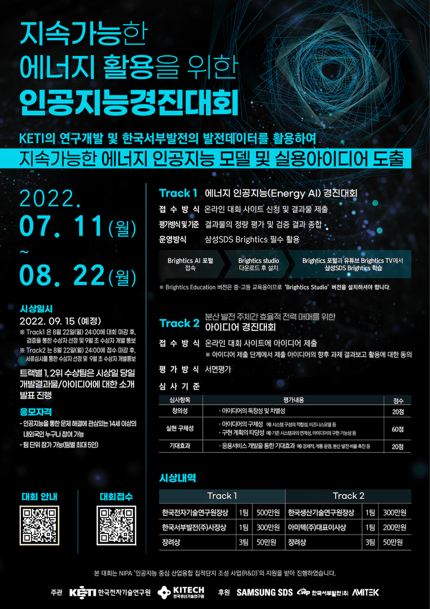

# Energy_AI_Competition

<p align='center'>
    
</p>

[지속가능한 에너지 활용을 위한 인공지능 경진대회: Track1 에너지 인공지능 경진대회](https://aifactory.space/competition/detail/2083)에서 Leaderboard Score (5등 / 41팀)을 달성한 결과물입니다.


## 대회 주제 소개
- KETI의 연구개발 및 한국서부발전(주)의 신재생 에너지 발전 실증 데이터에 기반한 인공지능 경진대회 운영을 통해 지속 가능한 인공지능 에너지 활용 모델 및 실용 아이디어를 도출하고자 합니다. 아래와 같이 2개의 Track으로 나뉘어져 진행됩니다.

### Track 1: 에너지 인공지능(Energy AI) 경진대회 (정량평가)
- 전력 거래소는 재생에너지 확대에 따른 출력 변동성 대응을 위해 재생에너지 발전량 예측제도를 도입했는데요, 이는 재생에너지 발전량을 하루 전에 미리 예측하여 제출하고 당일날 일정 오차율 이내로 이행할 경우 정산금을 지급하는 제도입니다.
- 따라서 발전 사업자들의 정확한 재생 에너지 예측 기술에 대한 필요성이 증가하게 되었으며, 이를 잘 예측하는 모델을 개발하는 것이 이번 Track1 과제의 핵심입니다.

## 대회 기간
- 2022년 7월 11일 ~ 2022년 8월 22일: 대회 기간
- 2022년 8월 23일 ~ 2022년 9월 02일: 제출물 검증 기간
- 2022년 9월 05일: 최종 수상팀 발표
- 2022년 9월 15일: 성과 발표 및 시상식

## 대회 미션
- 매일 17시 이전에 생성된 예보/실제 관측 데이터를 이용하여 익일 발전량을 예측

## 대회 규칙
- Public 및 private 스코어가 합쳐진 total 스코어로 최종 순위 및 검증 대상 결정
    - 대회기간 중에는 public 스코어만 리더보드 상에 표출
    - 대회 종료시점(8월 22일 23:59)이후 public 및 private 스코어가 합쳐진 total 스코어와 그에 따른 순위가 리더보드 상에 표출됨
    - Public 및 private의 비율은 1:1
- Track1의 경우 필수적으로 삼성 SDS의 Brightics Studio 플랫폼 사용
- 수상 후보팀으로 선정되는 경우 개발 결과물의 검증을 위하여 아래 파일을 일괄 제출
    1. 브라이틱스 프로젝트 json 파일
        - 브라이틱스로 데이터 전처리 및 분석한 프로젝트를 json으로 export하여 제출
    2. 모델 & 데이터 설명서
        - 서식을 다운로드 받아 내용 작성 후 제출
    3. Input 파일 (활용 데이터)
        - 외부 데이터 원본 (예: 기상예보 자료를 사용했을 경우, 다운받은 원본 상태의 파일)
        - 브라이틱스 모델에서 load하는 데이터 파일 (csv)
- 위 3가지 파일은 제 3자인 평가자가 이해 및 재현이 가능하도록 최대한 상세히 작성 후 제출 요망
- Track1의 평가에는 NMAE(Nominal Mean Absolute Error)가 활용됩니다. 연산 코드는 다음과 같습니다.
```python
import numpy as np

# Define NMAE loss function
def NMAE(true, pred, nominal):
    absolute_error = np.abs(true - pred)
    absolute_error /= nominal
    target_idx = np.where(true >= nominal*0.1)
    return 100 * absolute_error[target_idx].mean()
```
- 평가 연산에 사용되는 nominal 값은 다음과 같습니다.
    - solar: 1100
    - wind: 16000

## 제안 방법
- 기상청 외부 데이터로 일조량과 기압 데이터를 추가로 사용하였고, Boosting 모델을 사용하여 문제를 해결하고자 제안
- 자세한 내용은 [모델 & 데이터 설명서](모델&데이터설명서_감자샐러드.pdf)를 참고하시기 바랍니다.

## 코드 실행
- `KETI_경진대회_감자샐러드.json`을 `brights-studio`에 불러들여 실행하시면 됩니다.

## 느낀점
처음 나간 경진대회에서 LeaderBoard Score는 상위권에 달성했지만 수상을 하지 못해 매우 아쉽다고 생각한다.<br>
경진대회 데이터처럼 전처리 과정이 매우 복잡한 것은 처음 경험하여 부족함을 많이 느꼈다...<br>
태양광 발전량은 어느정도 예측이 되었으나 풍력 발전량은 예측이 매우 힘들어 error값이 높게 나와 매우 아쉬웠고, 추후 해당 프로젝트를 발전시켜 좀 더 정확한 예측을 해보고자 한다.

## 문의
코드 및 발표자료에 대해 궁금한 점이 있으실 경우 lhk6565@naver.com으로 문의해주시면 답변드리겠습니다.:blush:<br>
데이터에 대한 저작권은 대회 주관사인 [AIFactory 및 한국전자기술연구원](https://aifactory.space/)에 있으므로 해당 주관사로 문의 부탁드립니다.
